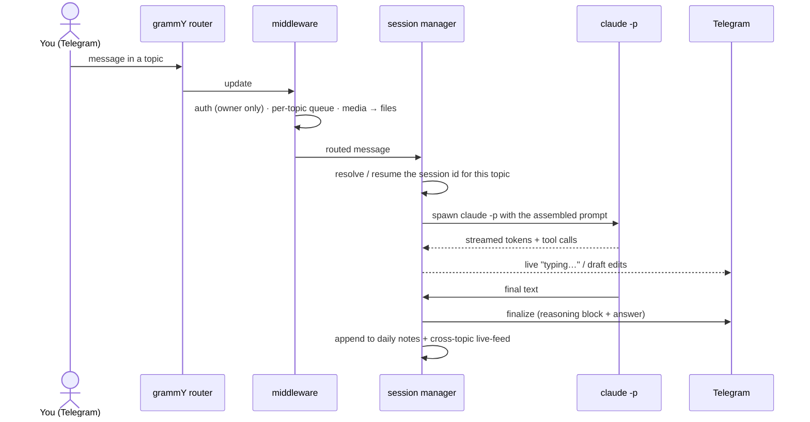
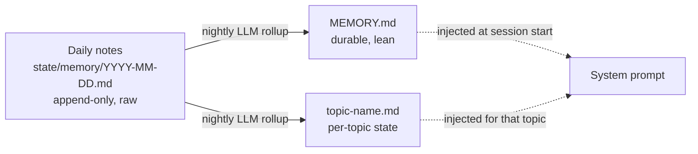

# Architecture

How Claw works under the hood — the turn lifecycle, per-topic session isolation, the
layered-memory pipeline, and the proactive cron layer. (For the *what* and *why*, see
the [README](./README.md); this is the *how*.)

## One agent per topic

A single Telegram supergroup with **forum topics** ("Coding", "Coach", "Finance", …)
is the UI. Each topic maps to its own **long-lived, resumable Claude Code session** with
its own persona and memory. Sessions never share context, so the agents don't bleed into
each other. Session ids are persisted per topic, so a restart *resumes* each conversation
instead of dropping it.

## Turn lifecycle

Key properties:

- **Per-topic queue** — messages in the same topic are serialized; different topics run concurrently.
- **Streaming** — partial output is edited into a live message, so you see progress, not a spinner.
- **One turn = one process.** A turn is a single `claude -p` run; when it ends, the process exits.
  Anything that must keep running runs *inside* the turn, or on the cron path below — never via a
  "wake me up later" mechanism, because nothing wakes a finished turn back up.

## Layered memory

The bot starts fresh every session, so continuity lives in files, in three tiers:

- **Daily notes** — every session appends YAML-block entries (`importance`, `tags`,
  `summarized_at: null`). The bar is low: if in doubt, log it.
- **Nightly rollup** — an LLM reads the unsummarized entries and promotes the durable ones into
  `MEMORY.md` (universal) or `topic-<name>.md` (per-topic), then stamps `summarized_at`. Raw notes
  are kept forever; the derived files stay lean.
- **Injection** — at session creation the prompt builder assembles persona + `MEMORY.md` + tools +
  the current topic's memory (`src/claude/prompt-builder.ts`). On long sessions it periodically
  re-injects so the rules don't fade.

See [`MEMORY.md.example`](./MEMORY.md.example) and the sample under `state/memory/` for the formats.

## Proactive layer (cron + heartbeat)

Scheduled `claude -p` jobs (systemd timers → `cron-scripts/run-cron.sh`) turn the bot from
reactive into proactive: triage the inbox, draft calendar events, post digests, run health checks.
Each job is a fresh isolated session whose result is routed to the right topic. Unit templates live
in `systemd/` with reliability drop-ins (`Restart=`, `OnFailure=`) and failure alerts.

## Self-maintenance

The assistant can read and edit its own source, rebuild (`npm run build`), and restart itself.
*Smart auto-clear* summarizes idle sessions into memory instead of nuking them mid-thought, so
context is distilled rather than lost.

## Where things live

| Concern | Path |
| --- | --- |
| Router, middleware, commands, guest mode | `src/bot/` |
| Session lifecycle (runner, auto-clear, prompt builder) | `src/claude/` |
| Markdown → Telegram HTML, streaming edits | `src/telegram/` |
| Topics, personas, models, constants | `src/config.ts` |
| Persona prompts | `personas/` |
| Scheduled-job prompts + runner | `cron-prompts/`, `cron-scripts/` |
| systemd unit/timer templates | `systemd/` |
