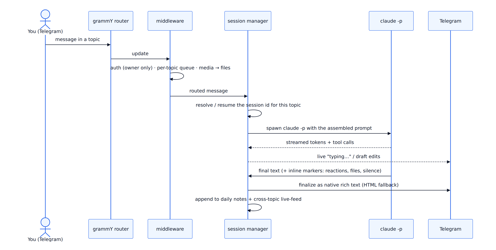
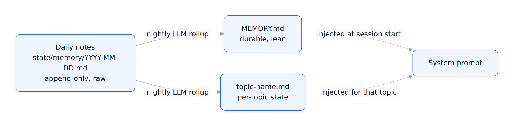

# Architecture

How Claw works under the hood — the turn lifecycle, per-topic session isolation, the
layered-memory pipeline, the rich-output path, the CLI toolbelt, and the proactive cron
layer. (For the *what* and *why*, see the [README](./README.md); this is the *how*.)

## One agent per topic

A single Telegram supergroup with **forum topics** ("Coding", "Coach", "Finance", …)
is the UI. Each topic maps to its own **long-lived, resumable Claude Code session** with
its own persona and memory. Sessions never share context, so the agents don't bleed into
each other. Session ids are persisted per topic, so a restart *resumes* each conversation
instead of dropping it.

Topics are keyed by Telegram's `message_thread_id`. A topic-enabled group's **General**
thread maps to the base key; each **sub-topic** gets a composite key, so a sub-topic is a
fully isolated session too — its own session id, memory file, and persona — not a view onto
the group's General session.

## Turn lifecycle

Key properties:

- **Per-topic queue** — messages in the same topic are serialized; different topics run concurrently.
- **Streaming** — partial output is edited into a live message, so you see progress, not a spinner.
- **Periodic re-injection** — on long sessions a compact digest of the operating rules is
  re-injected every N turns so the instructions don't fade out of the context window.
- **One turn = one process.** A turn is a single `claude -p` run; when it ends, the process exits.
  Anything that must keep running runs *inside* the turn, or on the cron path below, or via the
  background-job watcher (below) — never via a naive "wake me up later," because nothing wakes a
  finished turn back up by itself.

## Layered memory

The bot starts fresh every session, so continuity lives in files, in three tiers:

- **Daily notes** — every session appends YAML-block entries (`importance`, `tags`,
  `summarized_at: null`). The bar is low: if in doubt, log it.
- **Nightly rollup** — an LLM reads the unsummarized entries and promotes the durable ones into
  `MEMORY.md` (universal) or `topic-<name>.md` (per-topic), then stamps `summarized_at`. Raw notes
  are kept forever; the derived files stay lean.
- **Injection** — at session creation the prompt builder assembles persona + `MEMORY.md` + tools +
  the current topic's memory (`src/claude/prompt-builder.ts`). On long sessions it periodically
  re-injects so the rules don't fade.

See [`MEMORY.md.example`](./MEMORY.md.example) and the sample under `state/memory/` for the formats.

## Rich output

Replies are written as Markdown and sent as **native Telegram rich text** — the sender maps
GitHub-flavored Markdown plus a small set of inline HTML entities onto Telegram's rich-message
API: headings, **bold**/*italic*, `code` and fenced blocks, real tables, task lists, block quotes,
`$LaTeX$`, spoilers, `
` collapsibles, live timezone-aware date entities, location maps,
and inline images/video/audio. If a rich send is ever rejected, the sender **falls back** to a
legacy HTML pipeline so a formatting hiccup never drops the message.

Beyond plain text, the agent emits a few **inline markers** in its reply that the sender
intercepts and strips before sending:

- a **reaction** marker → set an emoji reaction on the triggering message,
- a **file/media** marker → send a local file as its own bubble (photo/video/audio/document),
- an **inline-media** marker → host a local file and embed it *inside* the message text,
- a **silence** marker → post nothing and just leave a "seen" reaction (for messages that don't
  warrant a reply).

This keeps the model's job to "write one Markdown reply"; the sender handles all the Telegram mechanics.

## The CLI toolbelt

A distinctive piece of the design: the agent **acts inside Telegram by shelling out to its own
small CLIs** (in `src/tools/`), rather than threading every capability through the bot process.
Each CLI is a standalone Node entry point that talks to the Telegram Bot API (or a render/host
service) and is invoked from a turn via the agent's Bash tool. Sanitized examples are included;
the pattern generalizes to:

| CLI | What it does |
| --- | --- |
| `claw-say` | post or edit a message; `--progress` manages **one** self-updating status line per turn |
| `claw-react` | set/clear an emoji reaction on a message |
| `claw-mermaid` | render Mermaid diagram code to a PNG (headless Chromium) so it shows as an image |
| `claw-host` | upload a local file to object storage and print a public URL (for inline embeds) |
| `claw-ask` | post a poll / quick-reply prompt and collect the answer |
| `claw-task` | delegate a parallel sub-agent and wait for / fold in its result |
| `claw-monitor` | arm a detached watcher on a pid/file/log that **wakes a fresh turn** when it's done |

Because each is a separate process reading the freshly built `dist/`, most can be updated without
restarting the bot. `claw-monitor` is how the bot honors "I'll let you know when it's done" without
a finished turn having to stay alive: it watches the job and triggers a new turn on completion.

## Proactive layer (cron + heartbeat)

Scheduled `claude -p` jobs (systemd timers → `cron-scripts/run-cron.sh`) turn the bot from
reactive into proactive: triage the inbox, draft calendar events, post digests, run health checks.
Each job is a fresh isolated session whose result is routed to the right topic. Unit templates live
in `systemd/` with reliability drop-ins (`Restart=`, `OnFailure=`) and failure alerts.

## Guest mode

The owner can `@mention` the bot in any chat where it **isn't** a member. The handler answers with
an instant **"thinking…" stub**, computes the real answer on a generous budget, then **edits the
stub** with the final reply — so a slow answer never blows the short guest window. Guest queries are
ephemeral: a fresh one-shot `claude -p` with a slim prompt and no memory side effects, gated to the
owner's Telegram user id before Claude is ever invoked.

## Self-maintenance

The assistant can read and edit its own source, rebuild (`npm run build`), and restart itself.
*Smart auto-clear* summarizes idle sessions into memory instead of nuking them mid-thought, so
context is distilled rather than lost. In production a **graceful restart** waits for in-flight
turns to finish before cycling the process, so a restart never kills a live turn mid-flight.

## Where things live

| Concern | Path |
| --- | --- |
| Router, middleware, commands, guest mode | `src/bot/` |
| Session lifecycle (runner, auto-clear, prompt builder) | `src/claude/` |
| Rich Telegram output + streaming edits | `src/telegram/` |
| The CLI toolbelt (post, react, diagrams, delegate, monitor) | `src/tools/` |
| Topics, personas, models, constants | `src/config.ts` |
| Persona prompts | `personas/` |
| Scheduled-job prompts + runner | `cron-prompts/`, `cron-scripts/` |
| systemd unit/timer templates | `systemd/` |
