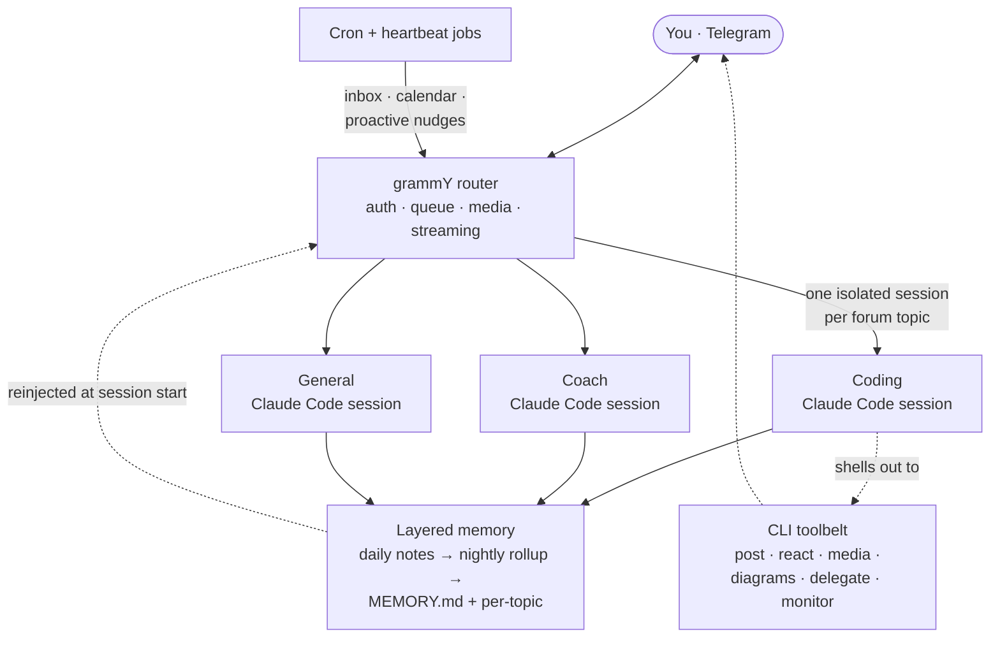

<div align="center">

# Claw 🪼

**A personal AI chief-of-staff that lives in Telegram.**

Every chat topic is its own isolated Claude Code agent — with a persona, persistent
memory, and a web of cron jobs that quietly keep an eye on your inbox, calendar, and life.


**Free skeleton — a June 2026 snapshot of the core engine.**
The living, complete system is **[Claw Pro](#-claw-pro--the-full-version)** (paid, private repo).

</div>

---

> ## ⚠️ This is the old, free version
>
> This repo is a **frozen mid-2026 snapshot** of Claw's core engine with maybe half of
> the upgrades the real system has today. It builds, it runs, and it's a solid base to
> study or hack on — but it's **not maintained**, some edges are rough by design, and the
> integrations that make Claw an actual chief-of-staff were stripped out.
>
> **Test it freely. If you want the real thing, [buy Claw Pro](#-claw-pro--the-full-version).**

Claw is my Telegram-based personal assistant. It's not a wrapper around a chat completion:
each Telegram forum topic spawns a **long-lived, resumable Claude Code session** with its
own persona and memory, so "Coding," "Coach," and "Finance" are genuinely different agents
that never bleed into each other. A nightly rollup distills the day's notes into durable
memory, a fleet of cron jobs turns the bot from reactive to **proactive**, and the
assistant talks back through Telegram's full native rich formatting by shelling out to its
own small CLI toolbelt.

## Architecture



> 📖 **Deeper dive:** [ARCHITECTURE.md](./ARCHITECTURE.md) — turn lifecycle, the memory
> pipeline, the rich-output path, and the CLI toolbelt, with diagrams.

## What this free snapshot gives you

- 🧠 **Per-topic isolated agents** — each forum topic is its own persistent Claude Code
  session with its own persona and memory file. No cross-talk, no context soup.
- 📚 **Memory that survives restarts** — append-only daily notes get promoted by a nightly
  LLM rollup into a lean long-term `MEMORY.md` plus per-topic files.
- ⏰ **Proactive, not just reactive** — a shared cron runner fires scheduled Claude jobs
  and routes results to the right topic.
- 💬 **Native rich Telegram output** — tables, task lists, `$LaTeX$`, spoilers,
  collapsibles, live date entities, inline media — with an automatic HTML fallback.
- 🧰 **A CLI toolbelt the bot wields itself** — post/edit a live progress line, drop a
  reaction, send media, render a diagram, delegate a sub-agent, arm a completion watcher.
- 🎭 **Personas & guest mode**, ♻️ **self-maintenance**, 🔧 **systemd patterns**.

## 💎 Claw Pro — the full version

The private repo is the **complete, current, sanitized production system** — every
subsystem below ran for months in the real deployment, with the operational docs
explaining why it's built that way. Two tiers in one repo (`main` = clean core,
`full` = everything):

| Area | What Pro has that this snapshot doesn't |
|---|---|
| 📬 **Heartbeat** | Deterministic email+calendar pipeline: SQLite ledger, batched LLM classify, per-topic alert routing, quiet hours + morning brief, open-loop inbox tracking, reply-to-archive, calendar auto-add with dedup & duplicate-twin cleanup, a live "situation header" in every session, evening debrief |
| 📦 **Packages & finance** | Shipment tracking with status cards; account/subscription ledger with lifecycle alerts and net-worth tracking |
| ❤️ **Health** | Wearable/food/scale/sleep ledger, wake-triggered daily digest, weekly review, FDR-gated cross-signal insights, designed cards |
| ☎️ **Voice** | The assistant makes real phone calls: realtime speech-to-speech, IVR navigation with synthesized keypresses, hold-music patience, call budgets, a local simulator |
| 🌐 **Browser agent** | Persistent headless-Chromium daemon surviving across turns (multi-turn logins/2FA), optional proxy via your Mac |
| 💻 **Mac control** | Tailscale SSH behind a fail-closed physical Allow/Deny gate with phone approval, time-boxed tap-free windows, keychain-context exec bridge |
| 🎛 **Hardware keypad** | Desk keypad bridge: sessions as RGB status lights, GO/STOP, push-to-talk voice, effort dial, model knob |
| 💡 **Idea engine** | Nightly source→generate→debate (Bull/Bear/Judge)→gate pipeline that stays silent unless an idea survives |
| 🚀 **Engine upgrades** | Multi-account subscription routing with per-model wall fallback, mid-turn steering, multi-agent work-log rendering, `/rewind` snapshots, structured `/compact` handoffs, incremental memory flush, memory search, partner mode (isolated second user), usage/cost analytics cards, and months of hardening this snapshot predates |

**How to buy:** email **me@lukres.dev** (or open an issue here and I'll reach out).
You get an invite to the private repo — both tiers, the docs, and my setup notes.

## Build your own (free version)

```bash
# 1. create a Telegram bot via @BotFather, make a topic-enabled supergroup
# 2. wire it up
cp .env.example .env          # add BOT_TOKEN, CHAT_ID, OWNER_USER_ID
npm install
#   edit src/config.ts  -> your topic IDs, personas, routing
#   write personas/*.md and cron-prompts/*.txt for your own life
npm run build && npm start
# 3. (optional) install the systemd units to run it 24/7 + on a schedule
```

**Start with [`CLAUDE.md`](./CLAUDE.md)** — it's the spec that defines what the assistant
is, how it remembers, and how it behaves. The TypeScript is the engine; `CLAUDE.md` is the soul.

## License

This snapshot: MIT — see [LICENSE](./LICENSE). Claw Pro is licensed separately (proprietary).

<div align="center">
<sub>Built by <a href="https://github.com/LuKresXD">@LuKresXD</a> · powered by Claude Code 🪼</sub>
</div>
