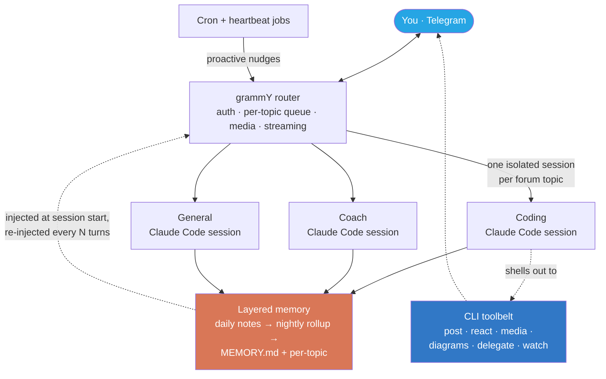
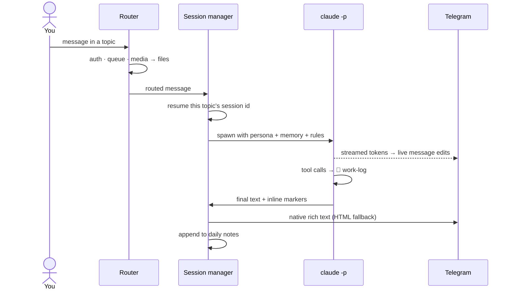
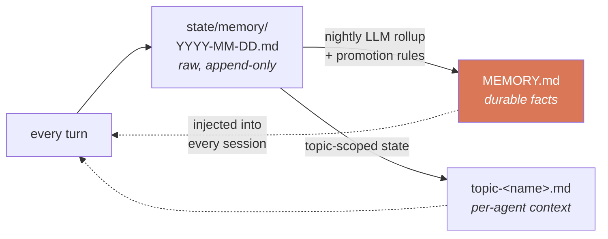
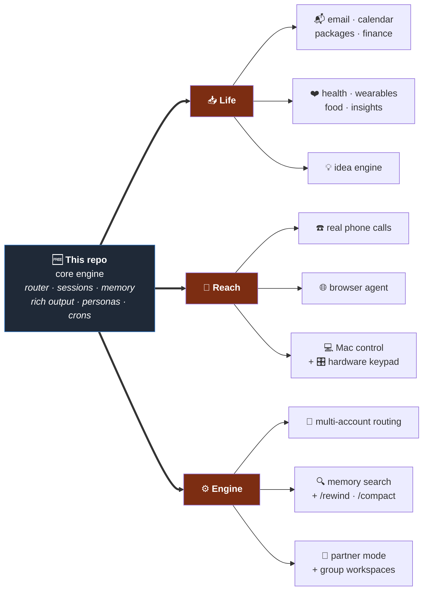

<div align="center">

# Claw 🪼

### A personal AI chief-of-staff that lives in Telegram

Every chat topic is its own **isolated Claude Code agent** — with a persona, persistent
memory, and a web of cron jobs that quietly keep an eye on your inbox, calendar, and life.


**Free skeleton — a June 2026 snapshot of the core engine.**
The living, complete system is **[Claw Pro](#-claw-pro--the-full-system)** · private repo · paid.

</div>

---

> ## ⚠️ Read this first — this is the old, free version
>
> This repo is a **frozen mid-2026 snapshot** of Claw's core engine, with roughly **half**
> the upgrades the real system has today. It builds, it runs, and it's a genuinely good base
> to study or hack on — but it is **not maintained**, some edges are rough by design, and every
> integration that makes Claw an actual chief-of-staff (inbox, calendar, health, voice calls,
> Mac control, finance…) was stripped out.
>
> **Test it freely. If you want the real thing → [Claw Pro](#-claw-pro--the-full-system).**

## What it actually is

Not a wrapper around a chat completion. Claw turns a Telegram supergroup into a **team of
agents**: each forum topic spawns a long-lived, resumable **Claude Code session** with its own
persona, its own memory file, and its own model tier. "Coding", "Coach" and "General" are
genuinely different assistants that never bleed into each other — and because they're Claude
Code sessions, they can read files, run commands, edit their own source, and ship a fix to
themselves while you watch.

A normal exchange looks like this:

```
You  →  "why is the deploy timer not firing?"
Claw ·  💭 reads the unit file, checks systemctl, greps the logs      ← live work-log
     ·  ⏳ 40% · checking timer state                                  ← self-updating progress
     →  "OnCalendar was UTC, your box is CDT — fixed and reloaded.
         Next run 04:15 in 3h."                                        ← native rich text
     ·  reacts 🫡 to your message, logs the fix to today's daily note
```

## Architecture



**The turn lifecycle** — what happens between your message and the reply:



**The memory pipeline** — why it remembers you tomorrow:



> 📖 **Deeper dive:** [ARCHITECTURE.md](./ARCHITECTURE.md) — turn lifecycle, session isolation,
> the memory pipeline, the rich-output path, and the CLI toolbelt, with more diagrams.

## What's in this free snapshot

| | Feature |
|---|---|
| 🧠 | **Per-topic isolated agents** — each forum topic is its own persistent Claude Code session, persona and memory file. Sub-topics in a supergroup get their own session too, keyed by thread. |
| 📚 | **Memory that survives restarts** — append-only daily notes, promoted by a nightly LLM rollup into a lean `MEMORY.md` plus per-topic files, re-injected at session start. |
| ⏰ | **Proactive, not just reactive** — a shared cron runner fires scheduled Claude jobs and routes results to the right topic. |
| 💬 | **Native rich Telegram output** — tables, task lists, fenced code, `$LaTeX$`, spoilers, `<details>` collapsibles, timezone-aware live date entities, maps, inline media — with automatic HTML fallback. |
| 🧰 | **A CLI toolbelt the bot wields itself** — post/edit a live progress line, drop a reaction, send media mid-turn. |
| 🎭 | **Personas & guest mode** — per-topic personas, prefix routing, and a stub-then-edit guest mode you can `@mention` from a chat the bot isn't even in. |
| ♻️ | **Self-maintenance** — Claw reads and edits its own source, rebuilds, restarts; smart auto-clear summarizes idle sessions into memory instead of nuking them mid-thought. |
| 🔧 | **Production patterns** — model-alias indirection, periodic context re-injection, streaming message edits, per-topic queueing, systemd units with reliability drop-ins. |

## Quick start

**You need:** a Linux box (or any machine that stays on), **Node 22+**, a **Claude Code**
subscription with the CLI logged in, and a Telegram account.

```bash
# 1 · Create the bot
#     @BotFather → /newbot → copy the token
#     @BotFather → /mybots → Bot Settings → Group Privacy → OFF
#
# 2 · Create your UI: a Telegram supergroup, then enable Topics in its settings.
#     Add your bot as an admin. Make a topic per agent: Coding, Coach, General…
#
# 3 · Install
git clone https://github.com/LuKresXD/claw-skeleton.git claw-bot && cd claw-bot
npm install
cp .env.example .env          # fill BOT_TOKEN, CHAT_ID, OWNER_USER_ID

# 4 · Point it at your topics
#     edit src/config.ts → topic ids, personas, memory files, model tiers
#     write personas/*.md and cron-prompts/*.txt for your own life

# 5 · Run
npm run build && npm start
```

**Finding the ids you need:** message your group, then open
`https://api.telegram.org/bot<TOKEN>/getUpdates` — `chat.id` is your `CHAT_ID`,
`from.id` is your `OWNER_USER_ID`, and `message_thread_id` is the topic id for each thread.

**Then read [`CLAUDE.md`](./CLAUDE.md).** It's the spec that defines what the assistant *is*,
how it remembers, and how it behaves. The TypeScript is the engine; `CLAUDE.md` is the soul —
adapt it and you've adapted the assistant.

<details>
<summary><b>Running it 24/7 (systemd)</b></summary>

```bash
# review the paths inside first — the units use absolute paths
sudo cp systemd/claw-bot.service /etc/systemd/system/
sudo systemctl daemon-reload
sudo systemctl enable --now claw-bot
journalctl -u claw-bot -f     # watch it come up
```

The `.service.d/` drop-ins carry the restart/reliability policy; `systemd/README.md`
explains the pattern, and `claw-cron-*.{service,timer}` is the template for a scheduled job.
</details>

<details>
<summary><b>Project structure</b></summary>

```
claw-skeleton/
├── CLAUDE.md           # the blueprint — what the assistant is and how it remembers
├── .env.example        # environment variables you fill in
├── src/
│   ├── bot/            # grammY router, middleware, commands, guest mode
│   ├── claude/         # session lifecycle: runner, auto-clear, checkpoints, prompt builder
│   ├── telegram/       # sender — rich output, streaming edits, HTML fallback
│   ├── tools/          # the CLI toolbelt the bot shells out to
│   ├── config.ts       # topics, personas, models, constants
│   └── index.ts        # entry point
├── cron-scripts/       # shared cron runner framework
├── cron-prompts/       # example scheduled-job prompts
├── systemd/            # unit + timer patterns
└── personas/           # example personas
```
</details>

---

## 💎 Claw Pro — the full system

The private repo is the **complete, current, production system**, sanitized for you to deploy.
Every subsystem below ran for months in the real daily-driver deployment, and the docs keep the
operational lessons that explain *why* each piece is built the way it is.



### Free vs Pro

| | 🆓 This snapshot | 💎 Claw Pro |
|---|:---:|:---:|
| Per-topic isolated agents | ✅ | ✅ |
| Layered memory + nightly rollup | ✅ | ✅ **+ memory search, incremental flush** |
| Rich Telegram output | ✅ | ✅ **+ collages, cards, diagrams, charts** |
| CLI toolbelt | 3 tools | **15+ tools** (polls, watchers, delegation, diagrams, hosting) |
| Personas & guest mode | ✅ | ✅ **+ partner mode (isolated 2nd user)** |
| Session lifecycle | auto-clear | **+ `/rewind`, structured `/compact`, checkpoints** |
| Model routing | single account | **multi-account pool, wall detection, usage cards** |
| Email + calendar pipeline | ❌ | ✅ deterministic, ledger-backed |
| Package tracking · finance | ❌ | ✅ |
| Health / wearables | ❌ | ✅ with statistical insights |
| Phone calls | ❌ | ✅ realtime voice, IVR navigation |
| Browser agent | ❌ | ✅ persistent, survives turns |
| Mac remote control | ❌ | ✅ fail-closed physical approval gate |
| Hardware keypad | ❌ | ✅ |
| Idea engine | ❌ | ✅ |
| Docs | this README | **README + SETUP + CLI reference + operations runbook + per-subsystem guides** |
| Maintained | frozen June 2026 | ✅ current |

### What Pro's subsystems actually do

<details>
<summary><b>📬 heartbeat-v2 — your inbox and calendar, handled</b></summary>

Deterministic pipeline (not an agent guessing): SQLite ledger, **one batched LLM classify per
sync**, per-topic alert routing, quiet hours, a code-rendered **morning brief**, open-loop
tracking (an email still in your inbox = still needs you), reply-to-archive from chat,
**calendar auto-add** with dedup + duplicate-twin cleanup, a live **situation header** injected
into every session so every agent knows what's going on in your life, and an evening debrief
that closes your day.
</details>

<details>
<summary><b>❤️ health-v2 — the read your wearable app won't give you</b></summary>

Wearable / food / scale / sleep / water / journal ledger with idempotent any-date re-sync,
a wake-triggered daily digest, weekly review, and **cross-signal insights with FDR-gated
statistics** (so it reports correlations that survive multiple-comparison correction, not noise).
Rendered as designed cards, not walls of numbers.
</details>

<details>
<summary><b>☎️ voice — it makes the call for you</b></summary>

Twilio + realtime speech-to-speech: the assistant **dials real phone numbers**, navigates IVR
menus with synthesized keypresses, waits through hold music silently, pulls you into the call
when a human picks up, and respects per-call/per-day budgets. Ships with a local simulator so
you can test the whole flow without dialing anyone.
</details>

<details>
<summary><b>💻 Mac control — with a physical off-switch</b></summary>

Tailscale SSH behind a **fail-closed Allow/Deny gate**: every command the bot runs on your Mac
pops a physical approval on that machine (asleep/locked/timeout = denied), with a phone prompt,
piped-stdin visibility, optional time-boxed tap-free windows, and a keychain-context exec bridge
for CLIs whose tokens live in the macOS keychain.
</details>

<details>
<summary><b>🚀 Engine upgrades this snapshot doesn't have</b></summary>

Multi-account subscription routing with per-model wall detection and automatic fallback ·
mid-turn steering (messages sent *while* a turn runs get injected into it) · multi-agent
work-log rendering · `/rewind` snapshot ring · structured `/compact` handoffs · incremental
mid-session memory flush · hybrid semantic+keyword memory search · usage/cost analytics cards ·
partner mode · months of hardening this snapshot predates.
</details>

### Get it

**Email → [me@lukres.dev](mailto:me@lukres.dev)** (or open an issue here and I'll reach out).

You get an invite to the private repo — **both tiers** (`main` = clean core, `full` =
every subsystem), the full documentation set, and my setup notes.

---

## FAQ

<details>
<summary><b>Do I need a Claude API key?</b></summary>

No — it drives the **Claude Code CLI**, so a Claude subscription with `claude` logged in on the
box is what it uses. Pro adds routing across several accounts.
</details>

<details>
<summary><b>Can more than one person use it?</b></summary>

This snapshot is single-owner by default (auth is an allowlist). Pro ships **partner mode** —
a fully isolated second user with their own topics, personas, crons and workspace who can never
see the owner's data — plus sealed group-chat workspaces.
</details>

<details>
<summary><b>What does it cost to run?</b></summary>

A small VPS (2 GB RAM is enough) plus your Claude subscription. The heavy cost lever is session
size, which is exactly why auto-clear, checkpoints and context-size-aware clearing exist.
</details>

<details>
<summary><b>Is my data going anywhere?</b></summary>

It runs on **your** box. Memory is plain markdown in your filesystem (and optionally your own
git repo / Obsidian vault). Nothing phones home.
</details>

## License

This snapshot: **MIT** — see [LICENSE](./LICENSE). Claw Pro is licensed separately (proprietary).

<div align="center">
<sub>Built by <a href="https://github.com/LuKresXD">@LuKresXD</a> · powered by Claude Code 🪼</sub>
</div>
