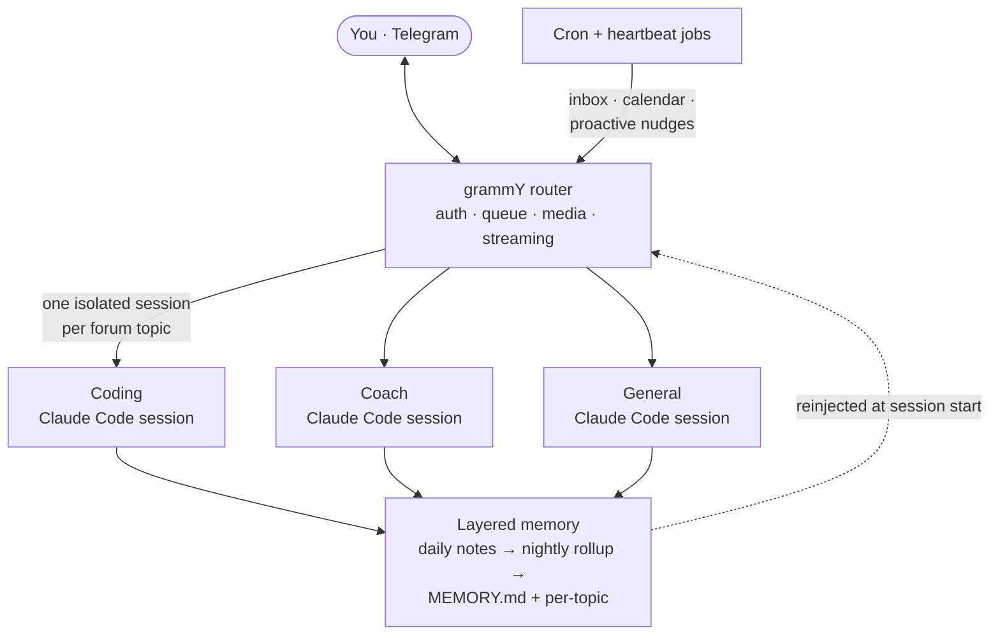

<div align="center">

# Claw 🪼

**A personal AI chief-of-staff that lives in Telegram.**

Every chat topic is its own isolated Claude Code agent — with a persona, persistent
memory, and a web of cron jobs that quietly keep an eye on your inbox, calendar, and life.


</div>

---

Claw is my Telegram-based personal assistant. This repo is its **open skeleton** — the full
engine and architecture, with my personal data and integrations stripped out so you can
build your own.

It's not a wrapper around a chat completion. Each Telegram forum topic spawns a **long-lived,
resumable Claude Code session** with its own persona and memory, so "Coding," "Coach," and
"Finance" are genuinely different agents that never bleed into each other. A nightly rollup
distills the day's notes into durable memory, and a fleet of cron jobs turns the bot from
reactive to **proactive** — triaging email, drafting calendar events, and nudging you before
you ask.

## Architecture



## What makes it interesting

- 🧠 **Per-topic isolated agents** — each forum topic is its own persistent Claude Code
  session with its own persona and memory file. No cross-talk, no context soup.
- 📚 **Memory that survives restarts** — append-only daily notes get promoted by a nightly
  LLM rollup into a lean long-term `MEMORY.md` plus per-topic files. The bot wakes up knowing you.
- ⏰ **Proactive, not just reactive** — a shared cron runner fires scheduled Claude jobs
  (inbox triage, calendar, digests, health) and routes the results to the right topic.
- 🎭 **Personas & guest mode** — per-topic personas, prefix routing, and a guest mode you
  can `@mention` from any chat the bot isn't even in.
- ♻️ **Self-maintaining** — Claw can read and edit its own source, rebuild, and restart;
  *smart auto-clear* summarizes idle sessions instead of nuking them mid-thought.
- 🔧 **Production-hardened details** — model-alias indirection, periodic context re-injection,
  streaming Telegram message edits, and systemd units with reliability drop-ins + failure alerts.

## Project structure

```
claw-skeleton/
├── CLAUDE.md           # the blueprint — what the assistant is and how it remembers
├── .env.example        # the environment variables you fill in
├── src/
│   ├── bot/            # grammY router, middleware, commands, guest mode
│   ├── claude/         # session lifecycle: runner, auto-clear, checkpoints, prompt builder
│   ├── telegram/       # sender — markdown → Telegram HTML, streaming edits
│   ├── util/           # logger, sanitizer, graceful shutdown
│   ├── config.ts       # topics, personas, models, constants
│   └── index.ts        # entry point
├── cron-scripts/       # shared cron runner framework + libs
├── cron-prompts/       # example scheduled-job prompts
├── systemd/            # unit + timer patterns (bot, cron, reliability drop-ins)
└── personas/           # example personas (default, coding, coach)
```

**Start with [`CLAUDE.md`](./CLAUDE.md)** — it's the spec that defines what the assistant
is, how it remembers, and how it behaves. The TypeScript is the engine; `CLAUDE.md` is the soul.

## Build your own

```bash
# 1. create a Telegram bot via @BotFather, make a topic-enabled supergroup
# 2. wire it up
cp .env.example .env          # add BOT_TOKEN, CHAT_ID, OWNER_USER_ID
npm install
#   edit src/config.ts  -> your topic IDs, personas, routing
#   write personas/*.md and cron-prompts/*.txt for your own life
npm run build && npm start
# 3. (optional) install the systemd units to run it 24/7 + on a schedule
```

This is a **sanitized skeleton**, not a turnkey app: the personal integrations
(email, calendar, finance, health…) and data were removed by design. Point your own Claude
Code at the repo and have it flesh out the parts you want — that's the whole idea.

## License

MIT — see [LICENSE](./LICENSE).

<div align="center">
<sub>Built by <a href="https://github.com/LuKresXD">@LuKresXD</a> · powered by Claude Code 🪼</sub>
</div>
